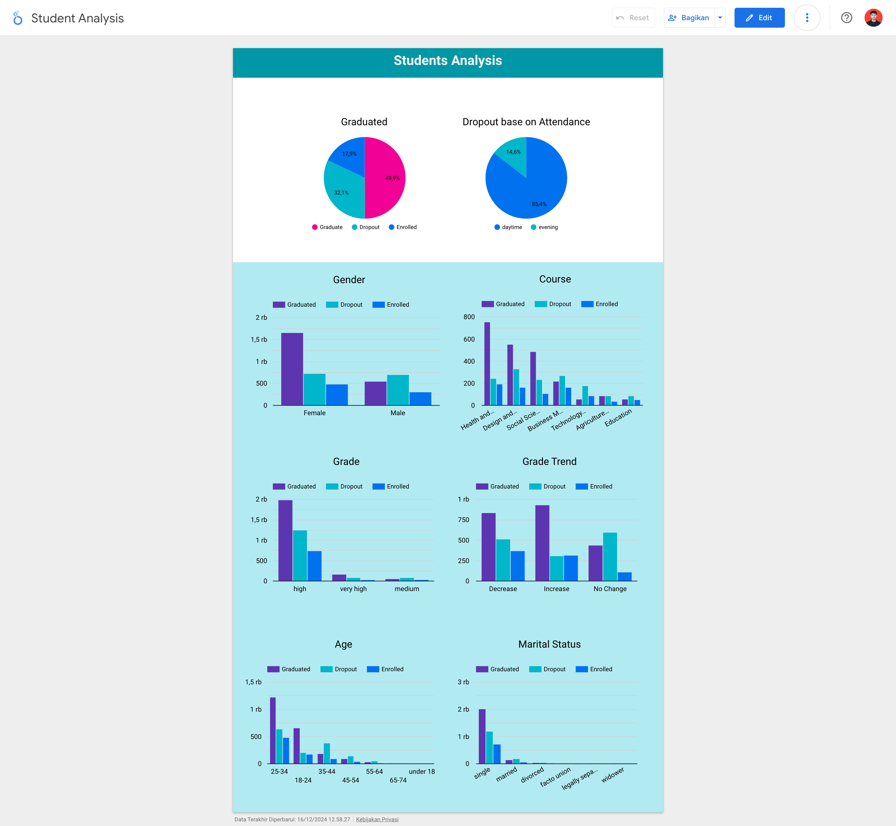
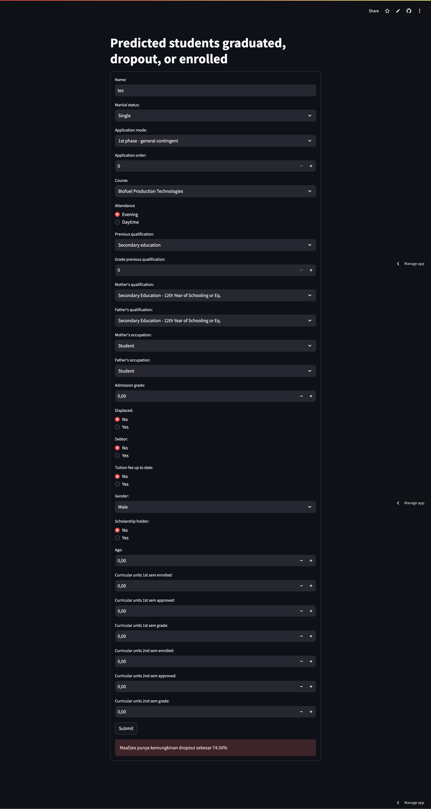

# Proyek Akhir: Menyelesaikan Permasalahan Institusi Pendidikan

## Business Understanding
This education company aims to improve the quality of higher education services and ensure student academic success. In an effort to create a supportive environment, companies want to understand the factors that influence student academic outcomes, such as graduation, dropout, and active status. Available data includes students' demographic, academic, and administrative information, which can be used to analyze patterns and trends in their academic journey.

The results of this analysis are expected to help companies make data-based decisions to reduce dropout rates, increase graduation rates, and design support strategies for vulnerable student groups.

### Permasalahan Bisnis
1. Distribution and Trends of Student Final Results:

   - What is the current distribution of student status (dropout, enrolled, graduate)?
   - Are there certain groups that are more at risk of dropping out than others?
   
2. Demographic Factors:

   - Do gender, age at enrollment, or marital status influence student outcomes?

3. Academic Factors:

   
   - Do scholarship recipients have higher graduation rates than those who do not?
   - Does a higher admission grade correlate with graduation rates?
   - How does the number of courses taken (credited, enrolled, evaluated, approved) affect the final results?

4. Operational Factors:

   - Does college attendance time (daytime/evening attendance) affect the possibility of graduation?
   - Do certain courses have higher dropout rates than other courses?

5. International Student Status:

   - How does status as an international student affect academic results?


### Cakupan Proyek
1. Data Distribution Analysis:

- Create a distribution of target variables (dropout, enrolled, graduate) to understand the overall academic status of students.

2. Demographic Factor Analysis:

- Testing the relationship between gender, age at registration, and marital status with student outcomes.

3. Academic Factor Analysis:

- Assess the influence of scholarship recipients on graduation.
- Identify the correlation between admission grade and graduation.
- Analyze the influence of the number of curricular units on student final results.

4. Operational Factor Analysis:

- Evaluate the relationship between lecture attendance (daytime/evening attendance) and final results.
- Compare dropout rates between courses.

5. International Student Analysis:

- Determine whether international student status affects graduation or dropout.

### Persiapan

Data source: <a href="https://doi.org/10.24432/C5MC89">link data</a>

Setup environment:
```bash
conda create -n myenv
conda activate myenv
pip install -r requirements.txt
```

## Business Dashboard

link:<a href="https://lookerstudio.google.com/reporting/5b97af44-0b48-4c1c-96dc-eb0388987899">link dashboard</a>

## Menjalankan Sistem Machine Learning


link:<a href="https://student-performance-predicted.streamlit.app/">link streamlit</a>

```bash
streamlit run app.py
```
Note: before running the command above, you must have completed the environment setup first

## Conclusion
The analysis reveals key insights into the factors influencing student outcomes in higher education. The majority of students successfully graduate, while dropout rates remain a concern, particularly for specific groups. Female students tend to graduate at a higher rate than males, although dropout rates are nearly identical across genders. Age at enrollment significantly affects outcomes, with the 25–34 age group showing the highest graduation rates, while younger and older students face challenges that lead to higher dropout rates. Similarly, marital status plays a role, as single students graduate at a higher rate compared to those who are married or divorced/widowed, likely due to fewer external responsibilities.

Scholarship recipients demonstrate significantly higher graduation rates and lower dropout rates, highlighting the importance of financial and academic support. Admission grades are positively correlated with graduation rates, though students with very high scores do not always perform better than those with high scores, suggesting other factors such as academic pressure might play a role. Daytime students exhibit better outcomes compared to those attending evening classes, indicating that attendance timing impacts academic success.

Curricular unit grades are a strong predictor of graduation, with students showing improved grades over semesters being more likely to graduate. Certain courses, such as science and technology, education, and business management, have higher dropout rates compared to health and nursing, social sciences, and design and media programs, which show better graduation outcomes. Interestingly, international and local students show similar performance, suggesting that support systems for international students are effective.

These findings highlight the need for targeted interventions, such as academic and financial support, flexible learning options, and course-specific improvements, to address challenges and improve overall student success.

### Rekomendasi Action Items
1. Reduce Dropout Rates:
- Implement early warning systems to identify at-risk students.
- Provide personalized academic support and counseling to struggling students.
- Offer workshops to improve time management, stress management, and study skills.

2. Optimize Admission Processes:
- Investigate challenges faced by students with very high admission grades to address academic pressure or lack of engagement.
- Offer preparatory or bridge courses for medium-grade students to reduce dropout rates.

3. Focus on Curricular Unit Performance:
- Implement regular progress tracking and provide feedback to students.
- Offer remedial classes and academic workshops for students with stagnant or declining grades.

4. Analyze High-Dropout Courses:
- Review curriculum design and workload for courses with high dropout rates.
- Conduct surveys to understand student challenges and align course offerings with their interests and career goals.